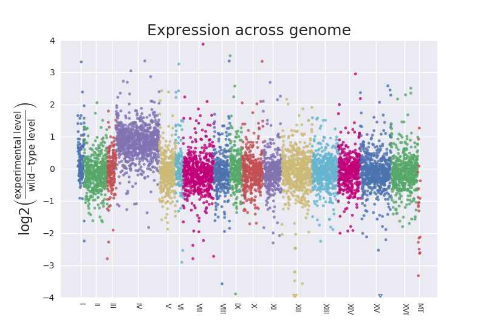
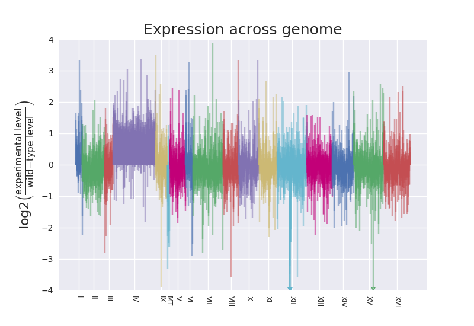
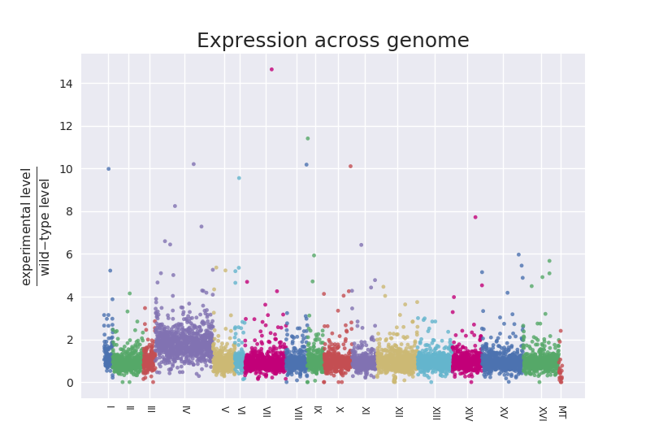
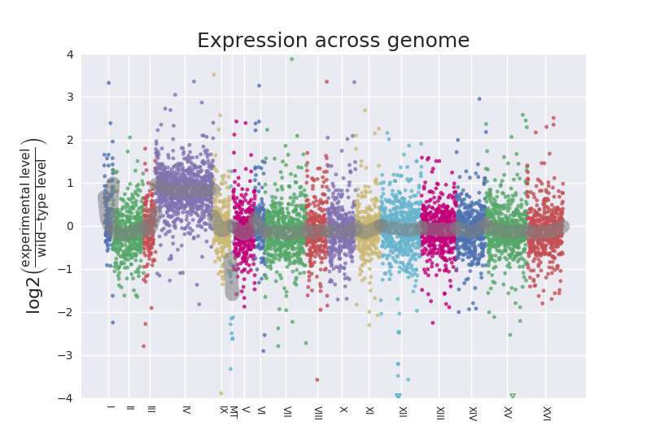
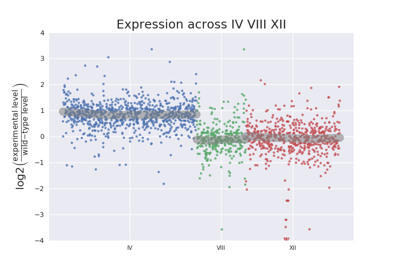
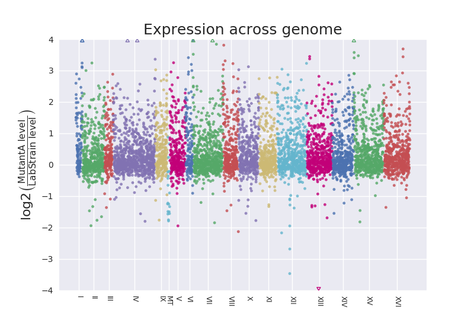

# plot_expression_across_chromosomes

At this time, there are two closely-related plotting scripts:

* One called, [`plot_expression_across_chromosomes.py`](https://github.com/fomightez/sequencework/tree/master/plot_expression_across_chromosomes#plot_expression_across_chromosomespy), is for summarized or combined data, such as that [from DESeq2](https://gist.github.com/fomightez/87bbf42b53ba001329785b44e8f652f8) or where TPM generated from [Salmon](https://combine-lab.github.io/salmon/) for several samples combined in different columns in one file.   
* The other, called [`plot_expression_across_chromosomes_direct.py`](https://github.com/fomightez/sequencework/tree/master/plot_expression_across_chromosomes#plot_expression_across_chromosomes_directpy), is for directly using quantified RNA-Seq data output generated from [Salmon](https://combine-lab.github.io/salmon/) or other quantifying software.

Descriptions of these scripts are below:

## plot_expression_across_chromosomes.py
> plots a ratio of expression values across chromosomes or scaffolds of a genome to highlight regions of deviation characteristic of aneuploidy or segmental duplication/deletion.

A Python script to plot ratio of expression of experimental condition vs. wild-type (or 
baseline state) for genes in sequential order across chromosomes in the genome. It requires two files: 1. a 
file of a genome annotation format in order to parse the locations of genes 
and (approximate) length of chromosomes; 2. a file of expression data to plot.
Currently, the script necessitates that the data is in a tab-delimited format. 
At this point to accomodate replicates, it is assumed you have in your data file for each gene the 
resulting (combined) level metric for the replicates, such as the mean TPM for
your "wild-type" samples and your mean TPM for your experimental samples. There 
is a related script for "raw" results produced by Salmon 
or HTSeq-count, see [`plot_expression_across_chromosomes_direct.py`](https://github.com/fomightez/sequencework/tree/master/plot_expression_across_chromosomes#plot_expression_across_chromosomes_directpy) below. For that one you just need to point the script at the raw data 
files and it will automagically handle the combining and produce a plot 
showing the expression of genes across the chromosomes.

Importantly, the plot script provided here is meant to be pipeline-agnostic. This means you should be able to take output from analysis of almost any RNA-Seq and generate such a plot. Every effort was made to make it not depend on what upstream or downstream analyses you used. It will work with any summarized or combined data, such as that [from DESeq2](https://gist.github.com/fomightez/87bbf42b53ba001329785b44e8f652f8) or where TPM generated from [Salmon](https://combine-lab.github.io/salmon/) for several samples combined in different columns in one file.  See more about this under details. The script may even be applicable to expresion ratios made from microarray data.  

You can generate chromosome profiles for individual chromosomes or only a few chromosomes or scaffolds by using the `--chrs` flag to limit the analysis to specific chromosomes or scaffolds.

**There is a [demo notebook for this script in this repo](https://github.com/fomightez/cl_sq_demo-binder).** Launch a binder session from there and select 'Demo of script to plot expression across chromosomes and genomes' to run it interactively in a Jupyter session.  The particular notebook can be viewed statically, nicely displayed [here](https://nbviewer.jupyter.org/github/fomightez/cl_sq_demo-binder/blob/master/notebooks/demo%20plot_expression_across_chromosomes.ipynb). The demonstration contains exmples for yeast and human. (For convenience the plots produced there are derived from mock data, while all the images shown on this page are from actual yeast data.) Presently, the requirements to run the human exceed the provided computational/memory capacity there. *Sorry.* And so I point you to the [static version](https://nbviewer.jupyter.org/github/fomightez/cl_sq_demo-binder/blob/master/notebooks/demo%20plot_expression_across_chromosomes.ipynb) to see how the human data can come out. You can move the demo to a place witih a larger capacity, such as Cyverse, and run it there for the human section. The command to get the human genetic information is commented out in the 3rd cell and you can modify the gunzip line to `!gunzip -k Homo_sapiens.GRCh38.88.chr.gtf.gz` because it will already be in the working directory and not need to be moved.

### QUICK-START GUIDE

Place the script in a directory with your genome annoation file and your summary data file.

**Command to issue:**

  	python plot_expression_across_chromosomes.py genes.gtf genes_mean_TPM.tsv --columns 1,2,4
	
Explanation of command: in the call to the script, provide the (1) genome annotation file, (2) the data file of values, and (3, optionally) specify columns in data to use for gene identifiers, baseline values, and experimental sample values, respectively. You don't need to specify the column numbers if those happen to be the first three columns in the data file.  
Resulting plot file, `genes_mean_TPM_across_chr.png`, produced:  
  
(The mutant strain in this real data example shows aneuploidy, specifically a duplication of chromosome IV.)
Additional feedback is reported in command line console when the script is run.


### USAGE SUMMARY

```
usage: plot_expression_across_chromosomes.py [-h] [-cols COLUMNS] [-l]
                                             [-chr CHRS] [-nl] [-nlim] [-s]
                                             [-ed EXP_DESIG] [-bd BASE_DESIG]
                                             [-ndh] [-ac ADVANCE_COLOR]
                                             ANNOTATION_FILE DATA_FILE

plot_expression_across_chromosomes.py plots a ratio of expression values
across chromosomes or scaffolds of a genome to highlight regions of deviation.
Besides the options listed here, there are several `USER ADJUSTABLE VALUES`
inside the script that can be edited for easy customization. A similar plot is
called a Manhattan plot and this implementation borrows the plotting approach
and some of the features from Brent Pedersen's awesome `manhattan-plot.py`
script. **** Script by Wayne Decatur (fomightez @ github) ***

positional arguments:
  ANNOTATION_FILE       Name of file containing the genome annotation.
                        REQUIRED. This is needed to determine the order of
                        individual data points along the chromosome and how to
                        display the data across chromosomes or scaffolds.
  DATA_FILE             Name of file containing the summarized data to plot,
                        such as mean TPM or RPKM, etc. in tab-delimited form.
                        REQUIRED. See my script
                        `plot_expression_across_chromosomes_from_raw.py` if
                        you want supply the individual `raw` data files with
                        the level metric for each sample &/or replicate.

optional arguments:
  -h, --help            show this help message and exit
  -cols COLUMNS, --columns COLUMNS
                        columns for gene, wild-type (baseline state)
                        expression value, experimental condition expression
                        value, in that order. This flag is used to specify the
                        data in the summary file to be plotted. Separate the
                        column identifiers by commas, without spaces. Default
                        is `1,2,3`, where `1` indicates the first column,
                        i.e., how you'd refer to the columns in natural
                        language (no zero-indexing).
  -l, --lines           add this flag to plot the expression level ratio value
                        as lines extending from the x-axis rather than points
                        in space. (The resulting aesthetic may resemble a city
                        skyline for which the `manhattan plot` is named.)
  -chr CHRS, --chrs CHRS
                        use this flag to limit plotting of the data to
                        particular chromosomes or scaffolds you specify
                        immediately following this flag. Separate the
                        chromosome or scaffold identifiers by commas, without
                        spaces. Example use in a command is `--chrs I,IV,XVI`. 
			Default when this optional flag is not called
                        is to plot that data for all chromosomes or scaffolds.
  -nl, --no_log         add this flag to keep the expression level ratio to be
                        plotted in the common base 10 instead of converting to
                        log2.
  -nlim, --no_limits    add this flag to not impose a limit of above and below
                        4 in plot window when converting to log2. The cutoff
                        can also be adjusted under `user-adjustable settings`
                        in the script. Issuing this flag has no effect if all
                        values are within +/- the cutoff interval or
                        `--no_log` is used.
  -s, --smooth          add this flag to display a smoothing curve fit to the
                        data points (LOWESS) on a per chromosome basis. This
                        option can enhance visualization of deviations
                        characteristic of aneuploidy and copy number variation
                        across the genome, both within and between
                        chromosomes. Additionally, a simplistically-based
                        assesment will be made for aneuploidy at the
                        chromosome or scaffold level and a notice will be made
                        as the program is running if aneuploidy at the
                        chromosome or scaffold level seems indicated by this
                        simple metric. Further examination is warranted
                        regardless of the result this automated assessment.
  -ed EXP_DESIG, --exp_desig EXP_DESIG
                        Allows changing the text used in y-axis label to
                        reference experimental sample. Following `--exp_desig`
                        type what you'd like to read there instead of
                        `experimental`.
  -bd BASE_DESIG, --base_desig BASE_DESIG
                        Allows changing the text used in y-axis label to
                        reference wild-type or baseline sample. Following
                        `--base_desig` type what you'd like to read there
                        instead of `wild-type`.
  -svg, --save_vg       add this flag to save as vector graphics
                        (**RECOMMENDED FOR PUBLICATION***) instead of default
                        png. Not default or saved alongside default because
                        file size can get large due to the large number of
                        points.
  -ndh, --no_data_header
                        add this flag if there is no data header or no first
                        line of column names in the data file. Otherwise, it
                        is assumed there is and any item read as the first
                        gene identifier from the first line won't be
                        highlighted as missing from annotation. IMPORTANTLY,
                        this only affects feedback provided as script is run.
                        If the first line resembles data, i.e., numbers in
                        specified columns, it will be automagically parsed as
                        if data. Remove the header or column labels line from
                        your summary data file on the off-chance this causes
                        issues in your resulting plot.
  -ac ADVANCE_COLOR, --advance_color ADVANCE_COLOR
                        **FOR ADVANCED USE.*** Allows for advancing the color
                        selection iterator the specified number of times. The
                        idea is it allows the ability to control the color of
                        the chromosome when specifying a chromosome or
                        scaffolds to plot so you could make the color match
                        the one used when all chromsome plotted if needed.
                        Supply the number to advance after the flag on the
                        command line. For example, `-ac 4`.
```

### EXAMPLE INPUT

The script requires a genome annotation file, typically `GTF` or `GFF` format in addition to the data. A good source of such files for several organisms is Illumina's iGenomes page described [here in the documentation for mock_expression_ratio_generator.py](https://github.com/fomightez/simulated_data/tree/master/gene_expression). Below is the first few lines of the yeast file:
```
I	ensembl	CDS	335	646	.	+	0	exon_number "1"; gene_biotype "protein_coding"; gene_id "YAL069W"; gene_name "YAL069W"; gene_source "ensembl"; gene_version "1"; p_id "P3634"; protein_id "YAL069W"; protein_version "1"; transcript_biotype "protein_coding"; transcript_id "YAL069W"; transcript_source "ensembl"; transcript_version "1"; tss_id "TSS1129";
I	ensembl	exon	335	649	.	+	.	exon_id "YAL069W.1"; exon_number "1"; exon_version "1"; gene_biotype "protein_coding"; gene_id "YAL069W"; gene_name "YAL069W"; gene_source "ensembl"; gene_version "1"; p_id "P3634"; transcript_biotype "protein_coding"; transcript_id "YAL069W"; transcript_source "ensembl"; transcript_version "1"; tss_id "TSS1129";
I	ensembl	start_codon	335	337	.	+	0	exon_number "1"; gene_biotype "protein_coding"; gene_id "YAL069W"; gene_name "YAL069W"; gene_source "ensembl"; gene_version "1"; p_id "P3634"; transcript_biotype "protein_coding"; transcript_id "YAL069W"; transcript_source "ensembl"; transcript_version "1"; tss_id "TSS1129";
I	ensembl	transcript	335	649	.	+	.	gene_biotype "protein_coding"; gene_id "YAL069W"; gene_name "YAL069W"; gene_source "ensembl"; gene_version "1"; p_id "P3634"; transcript_biotype "protein_coding"; transcript_id "YAL069W"; transcript_source "ensembl"; transcript_version "1"; tss_id "TSS1129";
I	ensembl	CDS	538	789	.	+	0	exon_number "1"; gene_biotype "protein_coding"; gene_id "YAL068W-A"; gene_name "YAL068W-A"; gene_source "ensembl"; gene_version "1"; p_id "P5379"; protein_id "YAL068W-A"; protein_version "1"; transcript_biotype "protein_coding"; transcript_id "YAL068W-A"; transcript_source "ensembl"; transcript_version "1"; tss_id "TSS5441";
I	ensembl	exon	538	792	.	+	.	exon_id "YAL068W-A.1"; exon_number "1"; exon_version "1"; gene_biotype "protein_coding"; gene_id "YAL068W-A"; gene_name "YAL068W-A"; gene_source "ensembl"; gene_version "1"; p_id "P5379"; transcript_biotype "protein_coding"; transcript_id "YAL068W-A"; transcript_source "ensembl"; transcript_version "1"; tss_id "TSS5441";
I	ensembl	start_codon	538	540	.	+	0	exon_number "1"; gene_biotype "protein_coding"; gene_id "YAL068W-A"; gene_name "YAL068W-A"; gene_source "ensembl"; gene_version "1"; p_id "P5379"; transcript_biotype "protein_coding"; transcript_id "YAL068W-A"; transcript_source "ensembl"; transcript_version "1"; tss_id "TSS5441";
I	ensembl	transcript	538	792	.	+	.	gene_biotype "protein_coding"; gene_id "YAL068W-A"; gene_name "YAL068W-A"; gene_source "ensembl"; gene_version "1"; p_id "P5379"; transcript_biotype "protein_coding"; transcript_id "YAL068W-A"; transcript_source "ensembl"; transcript_version "1"; tss_id "TSS5441";
I	ensembl	stop_codon	647	649	.	+	0	exon_number "1"; gene_biotype "protein_coding"; gene_id "YAL069W"; gene_name "YAL069W"; gene_source "ensembl"; gene_version "1"; p_id "P3634"; transcript_biotype "protein_coding"; transcript_id "YAL069W"; transcript_source "ensembl"; transcript_version "1"; tss_id "TSS1129";
I	ensembl	stop_codon	790	792	.	+	0	exon_number "1"; gene_biotype "protein_coding"; gene_id "YAL068W-A"; gene_name "YAL068W-A"; gene_source "ensembl"; gene_version "1"; p_id "P5379"; transcript_biotype "protein_coding"; transcript_id "YAL068W-A"; transcript_source "ensembl"; transcript_version "1"; tss_id "TSS5441";
I	ensembl	exon	1807	2169	.	-	.	exon_id "YAL068C.1"; exon_number "1"; exon_version "1"; gene_biotype "protein_coding"; gene_id "YAL068C"; gene_name "PAU8"; gene_source "ensembl"; gene_version "1"; p_id "P6019"; transcript_biotype "protein_coding"; transcript_id "YAL068C"; transcript_name "PAU8"; transcript_source "ensembl"; transcript_version "1"; tss_id "TSS251";
...
```

The other requirement is a tab-separated values data file with summarized expression level data for the samples.  You can get a script to make representative sample data for yeast (mock, computationally-generated) and see some lines of example data and the command to use the generated data with the `plot_expression_across_chromosomes.py` script [here](https://github.com/fomightez/simulated_data/tree/master/gene_expression). Below is an example of the first few lines of real sample data where each mean is the summary TPM of three replicates; the range information observed had been generated elsewhere just for convenience and is not used by this script.
```
gene	wt-mean	wt-range	exp1-mean	exp1-range	exp2-mean	exp2-range	exp3-mean	exp3-range
YCL050C	1934385.0	2031250.0—1837520.0	1980105.0	2241900.0—1718310.0	2291990.0	2338030.0—2245950.0	1929255.0	1948330.0—1910180.0
YAL069W	1487.3	1894.91—1079.75	3933.1	6052.86—1813.43	5379.6	5995.31—4763.8	8981.4	11689.9—6272.84
YCR101C	94676.5	95954.6—93398.4	135975.0	147361.0—124589.0	258703.0	264463.0—252943.0	231692.5	243090.0—220295.0
YBL095W	173002.0	186483.0—159521.0	89116.3	102525.0—75707.6	181074.0	196082.0—166066.0	143912.5	159024.0—128801.0
YBR252W	503598.0	549247.0—457949.0	326448.0	500957.0—151939.0	352356.5	439505.0—265208.0	740821.5	786769.0—694874.0
YBR050C	16822.3	19039.0—14605.6	10555.7	12993.3—8118.01	42378.5	47592.6—37164.4	45650.0	49513.2—41786.8
YBL049W	235924.5	242369.0—229480.0	305798.5	337907.0—273690.0	717022.0	730218.0—703826.0	716906.0	736337.0—697475.0
YCR061W	77743.6	89538.1—65949.2	151798.5	187690.0—115907.0	165490.0	179296.0—151684.0	105931.5	106644.0—105219.0
YBR206W	641524.5	711176.0—571873.0	525011.5	716450.0—333573.0	587209.0	661592.0—512826.0	566202.5	598600.0—533805.0
YBR292C	95053.9	105547.0—84560.8	71192.6	82512.1—59873.0	140236.5	146515.0—133958.0	169961.5	181390.0—158533.0
YBR063C	262637.5	275152.0—250123.0	280926.5	301261.0—260592.0	360739.0	367091.0—354387.0	364270.5	366100.0—362441.0
YBR122C	1026205.0	1046810.0—1005600.0	550934.0	596731.0—505137.0	1029225.0	1037420.0—1021030.0	898065.0	934471.0—861659.0
YBR271W	260899.5	266977.0—254822.0	224864.5	256225.0—193504.0	265945.0	283000.0—248890.0	303511.0	303605.0—303417.0
YBR279W	393835.0	395668.0—392002.0	306296.0	345034.0—267558.0	341899.5	389016.0—294783.0	368937.5	384419.0—353456.0
YBR155W	403514.0	407384.0—399644.0	361139.0	415079.0—307199.0	321550.5	375694.0—267407.0	427849.0	449817.0—405881.0
YBR067C	2770080.0	3065130.0—2475030.0	2294995.0	3163550.0—1426440.0	1411640.0	1704550.0—1118730.0	2613000.0	2912650.0—2313350.0
YCL008C	101020.4	124939.0—77101.8	73059.3	80640.8—65477.8	110608.5	112216.0—109001.0	99231.8	111501.0—86962.7
YBR270C	63764.2	65068.0—62460.3	57684.0	60022.5—55345.6	187334.5	192329.0—182340.0	187033.5	190934.0—183133.0
YAL068W-A	32028.8	35454.4—28603.2	100572.5	132746.0—68399.0	81218.4	102873.0—59563.7	90530.8	90665.3—90396.3
...
```


### EXAMPLE COMMANDS AND PLOTS PRODUCED

*Not all options are illustrated.*

**Command:**

  	python plot_expression_across_chromosomes.py genes.gtf genes_mean_TPM.tsv
	
Explanation: bare-bones, default example command for plotting points along chromosomes for genome.  
(This actually won't produce meaningful results from my example summary data because the experimental data is in the fourth tab-separated column and not the third that the default settings assume.)

**Command:**

  	python plot_expression_across_chromosomes.py genes.gtf genes_mean_TPM.tsv --columns 1,2,4
	
Explanation: specify columns in data to use other than default.  
Resulting plot file, `genes_mean_TPM_across_chr.png`, produced:  
  
(The mutant strain in this real data example shows aneuploidy, specifically disomy of chromosome IV.)

**Command:**

  	python plot_expression_across_chromosomes.py genes.gtf genes_mean_TPM.tsv --columns 1,2,4 --lines
	
Explanation: specify columns other than default and plot with vertical lines from zero.  
(This aesthetic came from seeing the `--lines` option in Brent Pederson's [Manhattan plot script](https://github.com/brentp/bio-playground/blob/master/plots/manhattan-plot.py).)
Resulting plot produced:  
  

**Command:**

	python plot_expression_across_chromosomes.py genes.gtf genes_mean_TPM.tsv --columns 1,2,4 --no_log
	
Explanation: specify columns other than default and don't convert ratio to log2 value.  
Resulting plot produced:  
  

**Command:**

	python plot_expression_across_chromosomes.py genes.gtf genes_mean_TPM.tsv --columns 1,2,4 --smooth

Explanation: specify columns other than default and add a line indicating a smooth curve fit to the data points.  
Resulting plot produced:  
  

The output will also include notice if aneuploidy is detected from a simplistic assessment using the smoothing data.

**Command:**

	python plot_expression_across_chromosomes.py genes.gtf genes_mean_TPM.tsv--columns 1,2,4 --chrs IV,VIII,XII --smooth
	
Explanation: specify columns other than default, add a line for a smooth fit to data points, and only plot for chromsomes IV, VIII, and XII. **IMPORTANTLY, note the lack of spaces between chromosome identifiers.**  
Resulting plot produced:  
  

The output will also include notice if aneuploidy is detected from a simplistic assessment using the smoothing data.

**Command:**

	python plot_expression_across_chromosomes.py genes.gtf genes_mean_TPM.tsv --columns 1,2,8 --base_desig LabStrain --exp_desig MutantA

Explanation: specify columns other than default and add custom labels for baseline ("wild-type") and experimental strain in plot.  
Resulting plot:  
  
(The mutant strain in this real data example does not exhibit chromosome aneuploidy.)

See example section [here](https://github.com/fomightez/simulated_data/tree/master/gene_expression#mock_expression_ratio_generatorpy) for additional commands and resulting plot examples, albeit from simulated data.

### DETAILS

The implemented plotting approach and other aspects borrow from Brent Pedersen's awesome
`manhattan-plot.py` script [here](https://github.com/brentp/bio-playground/blob/master/plots/manhattan-plot.py). (Many thanks to him for sharing that!)
This script should produce a plot similar to a combination of Brent Pedersen's
`manhattan-plot` that can be seen [here](https://github.com/brentp/bio-playground/tree/master/plots) and the plot in Figure 5B from Thorburn et al. 2013 (PMID: 23468524) that can be seen [here](https://www.ncbi.nlm.nih.gov/pmc/articles/PMC3639041/). In [this Twitter post from September 2020](https://twitter.com/yeastgenome/status/1305597730044035073) I saw an image using DNA sequencing coverage data that is reminiscent of those produced here. Fortunately, the article [The Genome Sequence of the Jean-Talon Strain, an Archeological Beer Yeast from Québec, Reveals Traces of Adaptation to Specific Brewing Conditions by Fijarczyk et al](https://www.g3journal.org/content/10/9/3087) goes into determining ploidy per chromosome in Figure 1 and has the R accompanying code for making the figures [here](https://github.com/Landrylab/Fijarczyk2020_JeanTalon/tree/master/01_ploidy_spore_viability_aneuploidies) which includes Figure 1D that is reminiscent of what `plot_expression_across_chromosomes.py` and `plot_expression_across_chromosomes_direct.py` produce.

There are several optional flags that can be supplied at the time of calling
the script to control options. These are shown if you invoke with `help` 
flag, i.e., type `python plot_expression_across_chromosomes.py --help` or simply call the script with no additional arguments. For example, you can generate chromosome profiles for individual chromosomes or only a few chromosomes or scaffolds by using the `--chrs` flag to limit the analysis to specific chromosomes or scaffolds. After the flag you supply the chromosomes or scaffolds to be examined, indicating multiple ones with a comma in between them **WITHOUT ANY SPACES**. See **Additional Details For Options** below. Additionally, 
inside the script there are several `USER ADJUSTABLE VALUES` that can be 
edited for easy customization.
Built to be general enough to be easily modified. For example, should be 
fairly straightforward to change to plotting ratio of sequencing coverage 
across chromosomes in a genome.

The script requires a genome annotation file, typically `GTF` or `GFF` format in addition to the data. A good source of such files for several organisms is Illumina's iGenomes page described [here in the documentation for mock_expression_ratio_generator.py](https://github.com/fomightez/simulated_data/tree/master/gene_expression). 
The highest value for `end` found in the annotation file (typically the `gtf` or `gff` format file) for a feature residing on a chromosome is used to determine the approximate length of each chromosome. You can add a "dummy" entry for a non-existent gene to your annotation file if you find the features in the file don't adequately reflect length of the chromosome.  
The information extracted from the genome annotation file could easily be obtained from other sources, such as the fantastic [YeastMine](http://yeastmine.yeastgenome.org/yeastmine/begin.do) in the case of yeast, but I choose to have the script parse the genome annotation file to try to keep it more broadly useable since one usually has such a file handy if performing RNA-Seq. This better allows use beyond what organisms are found with exisitng mines on the [Intermine](http://intermine.org/) platform.


Importantly, the plot script provided here is meant to be pipeline-agnostic. By way of contrast, DESeq2 can be used to plot fold changes in genomic space; however, it requires reading in data with `summarizeOverlaps`, as described [here](https://www.bioconductor.org/help/workflows/rnaseqGene/#plotting-fold-changes-in-genomic-space). Reading in data with `summarizeOverlaps` is just one of many of the routes to supplying count matrices into DESeq2. Additionally, you need to define gene models from GTF files by also constructing a TxDb object in DESeq2 prior to even being able to use `summarizeOverlaps` to generate count matrices. The plot_expression_across_chromosomes.py script provide here obviates many of those preparatory steps and makes it possible to take any route to generating such a plot. You can still use DESeq2 if you choose but with this script you aren't tied to using `summarizeOverlaps` and have the option to use any method, say tximport, to bring in counts. [Here is a gist where DESeq2-generated data was adjusted for use with this script](https://gist.github.com/fomightez/87bbf42b53ba001329785b44e8f652f8); the data used there was brought in to DESeq2 by a more classical approach than tximport, see [Wang et al 2016 (PMID: 26483013)](https://www.ncbi.nlm.nih.gov/pubmed/26483013) for an example along those lines. Similarly, NOISeq produces Manhattan plots for chromosomes as shown in [Figure 3 here](http://bioinfo.cipf.es/noiseq/lib/exe/fetch.php?media=noiseqbio_techreport.pdf), but then you are tied to NOISeq or have to do the analysis with at leat two different packages to get such a plot. Again, this script is meant to eliminate such additional steps, but still allow producing such plots. In fact, any method to produce a ratio of expression for a sample relative a baseline sample should work to be able to plot and the script may even be applicable to expresion ratios made from microarray data. 

The script will automatically make a name for the output file based on the name data file provided and whether covering whole genome or certain chromosomes.

Feedback is given as the script is run. This information will be sent to the command line console (standard out) and includes genes not matched in the data and the genome annotation file, genes whose values are left out to avoid errors caused by values of zero, an indication of suggested aneuploidy when the `--smooth` flag is used, etc..

**Additional Details For Options**

To avoid compressing the typically important range, by default the y-axis is limited to a range that emphasizes the alterations characteristic of aneuploidy or segmental duplication. (Specifically, upper and lower boundaries are truncated at a log2 ration of +4 and -4, by default.) Any points beyond those limits are plotted at the edge of the plot in a manner that distinguishes them from the other data points, i.e., they are represented as open triangles at the edge pointing in an up-or-down direction. This approach is styled on how DESeq2 plotMA handles out of bounds points, see section 1.5.1 of [the DESeq2 vignette](https://www.bioconductor.org/packages/devel/bioc/vignettes/DESeq2/inst/doc/DESeq2.html#ma-plot). Depending on your needs, run with the optional `--no_limits` or `--no_log` flags to see the full plot.


When the `--smooth` flag is employed, a non-parametric strategy (LOWESS or Locally Weighted Scatterplot Smoothing) is used to fit a curve to the data points for each chromosome. It highlights deviations in the scatterplots better than one could estimate just by eye given so many points. If the `--smooth` flag is used a simplistic, automated assessment will be made for aneuploidy at the chromosome-level (or per scaffold) and an notice will be included in the report as the script runs if anueploidy is suggested. You'll need to examime further no matter the outsome of that assessment. Right now the simplistic approach errs on the side of reporting more false positives but the settings used can be adjusted. In fact, I found a setting of `deviation_factor = 0.5` to work better in regards to almost eliminating false-postives, but I left it as `deviation_factor = 0.25` in the posted script for now.

### Known Issues and Workarounds

Running the script with a file of tab-separated values that looks good in text editors (and even on PythonAnywhere) may run with no noted error **YET** result in no plotted points because of issues with line endings. Be sure to convert MacOs line endings to Unix in your favorite text editor if you are using Mac Excel to save the summary table.


## plot_expression_across_chromosomes_direct.py
> plots directly from Salmon-quantified data files, i.e. `quant.sf` files, ratios of gene expression values across chromosomes or scaffolds of a genome to highlight regions of deviation characteristic of aneuploidy or segmental duplication/deletion. **It has options that should allow the use of almost any raw output from RNA-Seq quantification software.**

### QUICK-START GUIDE

Place the Pyhton script in a directory with your genome annoation file, along with directories containing your raw data files.

**Command to issue:**

  	python plot_expression_across_chromosomes_direct.py genes.gtf 140a/quant.sf 140b/quant.sf mut_a/quant.sf mut_b/quant.sf
	
Explanation of command: in the call to the script, provide the (1) genome annotation file, (2) the list of data files containing the quantified expression values. Here each data file is a `quant.sf` file generated by [Salmon](https://combine-lab.github.io/salmon/), and they are in subfolders corresponding to each replicate, i.e., `140a`, `140b`, `mut_a`, etc, in the example here. The TPM value, fourth column in the tab-separated output file, is used by default as the level for each gene. (At this time, I don't have [Salmon](https://combine-lab.github.io/salmon/)-generated sample data to offer but [Salmon](https://combine-lab.github.io/salmon/) is amazingly easy to add to your RNA-Seq analysis environment and use, see a full example [here](https://github.com/ctb/2017-ucdavis-igg201b/tree/master/lab8). My [Docker image for an RNA-Seq pipeline](https://hub.docker.com/r/fomightez/rnaseqwang/) provides a good basis for installing and using it.)  Optionally you can use output from other quantifying software; you'll just need to specify the data column with the `--data_column` flag, such as `--data_column 3` when calling the script. The script accommodates multiple replicates from the baseline and experimental samples. The wild-type(baseline) samples are always listed first. If the number of data files is odd or the ratio of wild-type(baseline) data files to experimental is not evenly split, you can use the `--wt_num` flag to specify a number that is to be used from the beginning of the file list as wild-type(baseline). For example if you have a total of 6 data files and the first two are replicates for wild-type, you would call the script with `--wt_num 2`. When mutltiple wild-type(baseline) or experimental sample replicates are used, a mean is calculated to produce the ratio relative wild-type(baseline) and subsequently that is used in the plotting.


The resulting plot will look like what is seen [here](https://github.com/fomightez/sequencework/tree/master/plot_expression_across_chromosomes#example-commands-and-plots-produced).

Unlike the [`plot_expression_across_chromosomes.py`](https://github.com/fomightez/sequencework/tree/master/plot_expression_across_chromosomes#plot_expression_across_chromosomespy) script, here there is `--no_data_header` setting because the script will try to read any line that looks like data., i.e., gene identifier in first column and a number in the data column. Header lines of Salmon-quantified data and most others will not resemble this and will be skipped. However, if you find you are getting weird genes reported as not matching in the report while running, you can just ignore it. The `--no_data_header` setting was only for suppressing odd notification.

See the [`plot_expression_across_chromosomes.py`](https://github.com/fomightez/sequencework/tree/master/plot_expression_across_chromosomes#plot_expression_across_chromosomespy) script above for further details of some of the options. In fact there is a **launchable, interactive demo** of that notebook as well and so see under its description for more on how to launch it actively [here](https://github.com/fomightez/cl_sq_demo-binder) and view it statically [here](https://nbviewer.jupyter.org/github/fomightez/cl_sq_demo-binder/blob/master/notebooks/demo%20plot_expression_across_chromosomes.ipynb).

### USAGE SUMMARY

```
usage: plot_expression_across_chromosomes_direct.py [-h] [-wn WT_NUM]
                                                    [-col COLUMN] [-l]
                                                    [-chr CHRS] [-nl] [-nlim]
                                                    [-s] [-ed EXP_DESIG]
                                                    [-bd BASE_DESIG] [-svg]
                                                    [-ac ADVANCE_COLOR]
                                                    ANNOTATION_FILE DATA_FILES
                                                    [DATA_FILES ...]

plot_expression_across_chromosomes_direct.py uses raw quantified RNA-seq data
(defaults to Salmon-generated data) to plot a ratio of expression values
across chromosomes or scaffolds of a genome to highlight regions of deviation.
Besides the options listed here, there are several `USER ADJUSTABLE VALUES`
inside the script that can be edited for easy customization. A similar plot is
called a Manhattan plot and this implementation borrows the plotting approach
and some of the features from Brent Pedersen's awesome `manhattan-plot.py`
script. **** Script by Wayne Decatur (fomightez @ github) ***

positional arguments:
  ANNOTATION_FILE       Name of file containing the genome annotation.
                        REQUIRED. This is needed to determine the order of
                        individual data points along the chromosome and how to
                        display the data across chromosomes or scaffolds.
  DATA_FILES            Names of files containing the data to plot, such as or
                        RPKM, etc. in tab-delimited form for at least one
                        wild-type(baseline) sample and one experimental
                        sample. AT LEAST TWO TOTAL REQUIRED. Assumed that it
                        is quantified by Salmon; specify column flag if level
                        not in fourth column. Wild-type(baseline) samples are
                        to be listed first. If number of files provided is
                        even and no `--wt_num` provided then first half is
                        considered wild-type set and the last half considered
                        experimental set. Use `--wt_num` flag to specify
                        number of wild-type base-line samples if not split
                        evenly or total number of data samples are an odd
                        number.

optional arguments:
  -h, --help            show this help message and exit
  -wn WT_NUM, --wt_num WT_NUM
                        use this flag followed by an integer to specify how
                        many of the initial data files provided are wild-
                        type(baseline) when samples not split evenly (e.g.,
                        `--wt_num 2` in case of 2 wild-type and 4 experimental
                        replicates) or using and odd number of total data
                        files. In the example where not split evenly, flag to
                        add to command call would be `--wt_num 2`.
  -col COLUMN, --column COLUMN
                        column for expression metric in data file. Assumes a
                        value of four to match fourth tab-separated column in
                        Salmon-quantified RNA-Seq data.
  -l, --lines           add this flag to plot the expression level ratio value
                        as lines extending from the x-axis rather than points
                        in space. (The resulting aesthetic may resemble a city
                        skyline for which the `manhattan plot` is named.)
  -chr CHRS, --chrs CHRS
                        use this flag to limit plotting of the data to
                        particular chromosomes or scaffolds you specify
                        immediately following this flag. Separate the
                        chromosome or scaffold identifiers by commas, without
                        spaces. Example use in a command is `--chrs I,IV,XVI`.
                        Default when this optional flag is not called is to
                        plot that data for all chromosomes or scaffolds.
  -nl, --no_log         add this flag to keep the expression level ratio to be
                        plotted in the common base 10 instead of converting to
                        log2.
  -nlim, --no_limits    add this flag to not impose a limit of above and below
                        4 in plot window when converting to log2. The cutoff
                        can also be adjusted under `user-adjustable settings`
                        in the script. Issuing this flag has no effect if all
                        values are within +/- the cutoff interval or
                        `--no_log` is used.
  -s, --smooth          add this flag to display a smoothing curve fit to the
                        data points (LOWESS) on a per chromosome basis. This
                        option can enhance visualization of deviations
                        characteristic of aneuploidy and copy number variation
                        across the genome, both within and between
                        chromosomes. Additionally, a simplistically-based
                        assesment will be made for aneuploidy at the
                        chromosome or scaffold level and a notice will be made
                        as the program is running if aneuploidy at the
                        chromosome or scaffold level seems indicated by this
                        simple metric. Further examination is warranted
                        regardless of the result this automated assessment.
  -ed EXP_DESIG, --exp_desig EXP_DESIG
                        Allows changing the text used in y-axis label to
                        reference experimental sample. Following `--exp_desig`
                        type what you'd like to read there instead of
                        `experimental`.
  -bd BASE_DESIG, --base_desig BASE_DESIG
                        Allows changing the text used in y-axis label to
                        reference wild-type or baseline sample. Following
                        `--base_desig` type what you'd like to read there
                        instead of `wild-type`.
  -svg, --save_vg       add this flag to save as vector graphics
                        (**RECOMMENDED FOR PUBLICATION***) instead of default
                        png. Not default or saved alongside default because
                        file size can get large due to the large number of
                        points.
  -ac ADVANCE_COLOR, --advance_color ADVANCE_COLOR
                        **FOR ADVANCED USE.*** Allows for advancing the color
                        selection iterator the specified number of times. The
                        idea is it allows the ability to control the color of
                        the chromosome when specifying a chromosome or
                        scaffolds to plot so you could make the color match
                        the one used when all chromsome plotted if needed.
                        Supply the number to advance after the flag on the
                        command line. For example, `-ac 4`.
```


### EXAMPLE INPUT

See [here](https://github.com/fomightez/sequencework/blob/master/plot_expression_across_chromosomes/README.md#example-input) for the first few lines of the example gene annotation file, `genes.gtf`.

Example RNA-Seq quantified data from Salmon -- below are the first few lines from a single `quant.sf` file:
```
Name  Length  EffectiveLength TPM NumReads
YHR055C 186 57  1207.88 4882.61
YPR161C 1974  1830.58 15.3289 1990
YOL138C 4026  4297.28 4.22309 1287
YDR395W 2835  3482.75 61.7479 15251
YGR129W 648 502.901 27.7306 989
YPR165W 630 372.191 533.133 14072
YPR098C 486 224.737 120.719 1924
YPL015C 1074  582.858 62.296  2575
YCL050C 966 683.142 233.803 11327
YAL069W 315 148 0.47638 5
YMR193W 777 1244.28 29.1925 2576
YLR031W 561 770.739 47.1651 2578
YIL014C-A 315 193.48  143.136 1964
YGR053C 852 1077.64 5.86207 448
YCR101C 549 539.053 26.4463 1011
...
```

### EXAMPLE OUTPUT

See [above](https://github.com/fomightez/sequencework/tree/master/plot_expression_across_chromosomes#example-commands-and-plots-produced) for an idea of the styles of plots that can be produced by [`plot_expression_across_chromosomes_direct.py`](https://github.com/fomightez/sequencework/tree/master/plot_expression_across_chromosomes#plot_expression_across_chromosomes_directpy) . Because [`plot_expression_across_chromosomes_direct.py`](https://github.com/fomightez/sequencework/tree/master/plot_expression_across_chromosomes#plot_expression_across_chromosomes_directpy) only differs from [`plot_expression_across_chromosomes.py`](https://github.com/fomightez/sequencework/tree/master/plot_expression_across_chromosomes#plot_expression_across_chromosomespy) in how the expression data is accessed, the results produced are the same.

Running Environment Suggestion
-----------------------------

These scripts should work wherever you run Python with modern [Pandas](http://pandas.pydata.org/) and [Matplotlib](https://matplotlib.org/) modules. In particular, I can recommend [PythonAnywhere.com](https://www.pythonanywhere.com) for an environment that will go where you do without requiring additional installs for each computer you use. I have an older account to the cloud-based service, and so I needed to use `pip install --user` (or was it `pip install --user --upgrade`? ) for those two modules to get updated versions; you may not need to do this. Parsing the genome annotation file will tax compute time for PythonAnywhere's free tier, but it will eventually work (at least for yeast), even if you get yourself in [their tarpit](https://www.pythonanywhere.com/tarpit/). You may need to simply rerun the last command if your job is 'killed'. In fact, I developed all these related scripts and made all the plots on this page and [this page](https://github.com/fomightez/simulated_data/tree/master/gene_expression#mock_expression_ratio_generatorpy) on [PythonAnywhere.com](https://www.pythonanywhere.com).

### Licensing

[`plot_expression_across_chromosomes_direct.py`](https://github.com/fomightez/sequencework/tree/master/plot_expression_across_chromosomes#plot_expression_across_chromosomes_directpy) and [`plot_expression_across_chromosomes.py`](https://github.com/fomightez/sequencework/tree/master/plot_expression_across_chromosomes#plot_expression_across_chromosomespy) are licensed under MIT.

Related items by myself
-------------------------

I have made a script that will run the plot across the entire yeast genome as well as making plots for each chromosome individually, except mitochondrial one, automagically. It could probably by easily modified for any genome and set of data where [`plot_expression_across_chromosomes.py`](https://github.com/fomightez/sequencework/tree/master/plot_expression_across_chromosomes#plot_expression_across_chromosomespy) works. There is a separate script that combines the images from several samples into a report summary for each. The two related scripts are:
* [`shepherds_chr_thru_plot_expression_across_chromosomes.py`](https://github.com/fomightez/mini-pipelines)
* [`generate_reports_for_genome_and_all_chromosomes_various_samples.py`](https://github.com/fomightez/mini-pipelines)  

They can both be found [here](https://github.com/fomightez/mini-pipelines) in my [mini-pipelines repository](https://github.com/fomightez/mini-pipelines).

Additionally, I have made a script for generating simulated data files where you can designate what chromosomes or scaffolds differ from the baseline and by what fold. That script, called `mock_expression_ratio_generator.py`, can be found [here](https://github.com/fomightez/simulated_data/tree/master/gene_expression).


Related items by others
-----------------------

- [karyoploteR](https://bernatgel.github.io/karyoploter_tutorial/)
	>"karyoploteR is an R package to create karyoplots, that is, representations of whole genomes with arbitrary data plotted on them. ... The aim of karyoploteR is to offer the user an easy way to plot data along the genome to get broad genome-wide view to facilitate the identification of genome wide relations and distributions." For example, see 'Rainfall plots' [here](https://bernatgel.github.io/karyoploter_tutorial/#Examples).

- R code to plot expression across chromosomes in Jupyter notebooks looks to be demonstrated [here](https://twitter.com/ODiogoSilva/status/898241229250605056) by Diogo Silva for an organism with 12 chromosomes, but I haven't found the actual code yet.

- [gos: (epi)genomic visualization in python](https://gosling-lang.github.io/gos/)
	>"gos is a declarative (epi)genomics visualization library for Python. It is built on top of the Gosling JSON specification, providing an simplified interface for authoring interactive genomic visualizations."

- For use with targeted sequencing to look for CNVs:
[CNVkit: Copy number detection and visualization for targeted sequencing using off-target read.]

    - Preprint https://www.biorxiv.org/content/early/2018/09/04/408534?rss=1
    - Docs https://cnvkit.readthedocs.io/en/stable/ 
    - Examples https://github.com/etal/cnvkit-examples …
    - Tutorial https://www.youtube.com/watch?v=JGOIXYoLG6w&feature=youtu.be

- I listed some other related resources [here](https://www.biostars.org/p/183822/#253097).

- There's some related resources in replies to [this post at Biostars](https://www.biostars.org/p/9501962/#9501962). I especially like the binning idea this one suggests. Maybe that would be a better way to plot the human chromosome data in the demo????


