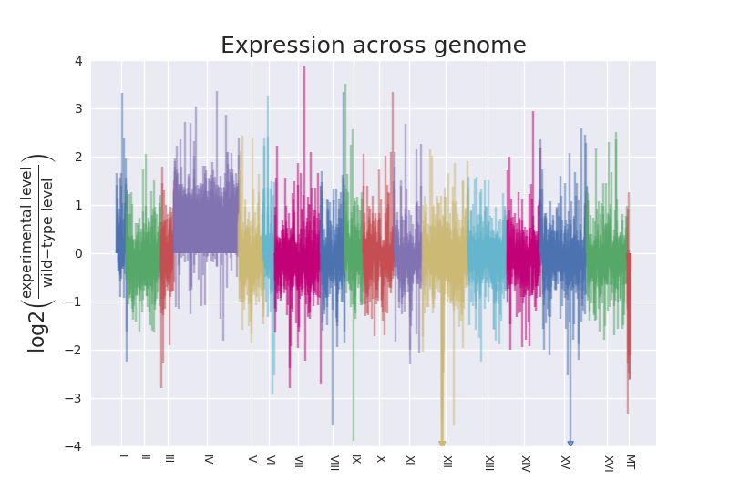

# plot_expression_across_chromosomes.py

> plots a ratio of expression values across chromosomes or scaffolds of a genome to highlight regions of deviation characteristic of aneuploidy or segmental duplication/deletion.

A python script to plot ratio of expression of experimental condition vs. wild-type (or 
baseline state) for genes in sequential order across chromosomes in the genome. It requires two files: 1. a 
file of a genome annotation format in order to parse the locations of genes 
and (approximate) length of chromosomes; 2. a file of expression data to plot.
Currently, the script necessitates that the data is in a tab-delimited format. 
At this point to accomodate replicates, it is assumed you have in your data file for each gene the 
resulting (combined) level metric for the replicates, such as the mean TPM for
your "wild-type" samples and your mean TPM for your experimental samples. In 
the future there will be a related script for "raw" results produced by Salmon 
or HTSeq-count. The hope being you just need to point the script at the raw data 
files and it will automagically handle the combining and produce a plot 
showing the expression of genes across the chromosomes.

Importantly, the plot script provided here is meant to be pipeline-agnostic. This means you should be able to take output from analysis of almost any RNA-Seq and generate such a plot. Every effort was made to make it not depend on what upstream or downstream analyses you used. See more about this under details. 

You can generate chromosome profiles for individual chromosomes or only a few chromosomes or scaffolds by using the `--chrs` flag to limit the analysis to specific chromosomes or scaffolds.

### QUICK-START GUIDE

Place the script in a directory with your genome annoation file and your summary data file.

**Command to issue:**

  	python plot_expression_across_chromosomes.py genes.gtf genes_mean_TPM.tsv --columns 1,2,4
	
Explanation of command: in the call to the script, provide the (1) genome annotation file, (2) the data file of values, and (3, optionally) specify columns in data to use for gene identifiers, baseline values, and experimental sample values, respectively. You don't need to specify the column numbers if those happen to be the first three columns in the data file.  
Resulting plot file, `genes_mean_TPM_across_chr.png`, produced:  
  
(The mutant strain in this real data example shows aneuploidy, specifically disomy of chromosome IV.)


### USAGE SUMMARY

```
usage: plot_expression_across_chromosomes.py [-h] [-cols COLUMNS] [-l]
                                             [-chr CHRS] [-nl] [-nlim] [-s]
                                             [-ed EXP_DESIG] [-bd BASE_DESIG]
                                             [-ndh] [-ac ADVANCE_COLOR]
                                             ANNOTATION_FILE DATA_FILE

plot_expression_across_chromosomes.py plots a ratio of expression values
across chromosomes or scaffolds of a genome to highlight regions of deviation.
Besides the options listed here, there are several `USER ADJUSTABLE VALUES`
inside the script that can be edited for easy customization. A similar plot is
called a Manhattan plot and this implementation borrows the plotting approach
and some of the features from Brent Pedersen's awesome `manhattan-plot.py`
script. **** Script by Wayne Decatur (fomightez @ github) ***

positional arguments:
  ANNOTATION_FILE       Name of file containing the genome annotation.
                        REQUIRED. This is needed to determine the order of
                        individual data points along the chromosome and how to
                        display the data across chromosomes or scaffolds.
  DATA_FILE             Name of file containing the summarized data to plot,
                        such as mean TPM or RPKM, etc. in tab-delimited form.
                        REQUIRED. See my script
                        `plot_expression_across_chromosomes_from_raw.py` if
                        you want supply the individual `raw` data files with
                        the level metric for each sample &/or replicate.

optional arguments:
  -h, --help            show this help message and exit
  -cols COLUMNS, --columns COLUMNS
                        columns for gene, wild-type (baseline state)
                        expression value, experimental condition expression
                        value, in that order. This flag is used to specify the
                        data in the summary file to be plotted. Separate the
                        column identifiers by commas, without spaces. Default
                        is `1,2,3`, where `1` indicates the first column,
                        i.e., how you'd refer to the columns in natural
                        language (no zero-indexing).
  -l, --lines           add this flag to plot the expression level ratio value
                        as lines extending from the x-axis rather than points
                        in space. (The resulting aesthetic may resemble a city
                        skyline for which the `manhattan plot` is named.)
  -chr CHRS, --chrs CHRS
                        use this flag to limit plotting of the data to
                        particular chromosomes or scaffolds you specify
                        immediately following this flag. Separate the
                        chromosome or scaffold identifiers by commas, without
                        spaces. Example use in a command is `--chrs I,IV,XVI`. 
			Default when this optional flag is not called
                        is to plot that data for all chromosomes or scaffolds.
  -nl, --no_log         add this flag to keep the expression level ratio to be
                        plotted in the common base 10 instead of converting to
                        log2.
  -nlim, --no_limits    add this flag to not impose a limit of above and below
                        4 in plot window when converting to log2. The cutoff
                        can also be adjusted under `user-adjustable settings`
                        in the script. Issuing this flag has no effect if all
                        values are within +/- the cutoff interval or
                        `--no_log` is used.
  -s, --smooth          add this flag to display a smoothing curve fit to the
                        data points (LOWESS) on a per chromosome basis. This
                        option can enhance visualization of deviations
                        characteristic of aneuploidy and copy number variation
                        across the genome, both within and between
                        chromosomes.
  -ed EXP_DESIG, --exp_desig EXP_DESIG
                        Allows changing the text used in y-axis label to
                        reference experimental sample. Following `--exp_desig`
                        type what you'd like to read there instead of
                        `experimental`.
  -bd BASE_DESIG, --base_desig BASE_DESIG
                        Allows changing the text used in y-axis label to
                        reference wild-type or baseline sample. Following
                        `--base_desig` type what you'd like to read there
                        instead of `wild-type`.
  -ndh, --no_data_header
                        add this flag if there is no data header or no first
                        line of column names in the data file. Otherwise, it
                        is assumed there is and any item read as the first
                        gene identifier from the first line won't be
                        highlighted as missing from annotation. IMPORTANTLY,
                        this only affects feedback provided as script is run.
                        If the first line resembles data, i.e., numbers in
                        specified columns, it will be automagically parsed as
                        if data. Remove the header or column labels line from
                        your summary data file on the off-chance this causes
                        issues in your resulting plot.
  -ac ADVANCE_COLOR, --advance_color ADVANCE_COLOR
                        **FOR ADVANCED USE.*** Allows for advancing the color
                        selection iterator the specified number of times. The
                        idea is it allows the ability to control the color of
                        the chromosome when specifying a chromosome or
                        scaffolds to plot so you could make the color match
                        the one used when all chromsome plotted if needed.
                        Supply the number to advance after the flag on the
                        command line. For example, `-ac 4`.
```

### EXAMPLE INPUT

The script requires a genome annotation file, typicall `GTF` or `GFF` format in addition to the data. A good source of such files for several organisms is Illumina's iGenomes page described [here in the documentation for mock_expression_ratio_generator.py](https://github.com/fomightez/simulated_data/tree/master/gene_expression). Below is the first few lines of the yeast file:
```
I	ensembl	CDS	335	646	.	+	0	exon_number "1"; gene_biotype "protein_coding"; gene_id "YAL069W"; gene_name "YAL069W"; gene_source "ensembl"; gene_version "1"; p_id "P3634"; protein_id "YAL069W"; protein_version "1"; transcript_biotype "protein_coding"; transcript_id "YAL069W"; transcript_source "ensembl"; transcript_version "1"; tss_id "TSS1129";
I	ensembl	exon	335	649	.	+	.	exon_id "YAL069W.1"; exon_number "1"; exon_version "1"; gene_biotype "protein_coding"; gene_id "YAL069W"; gene_name "YAL069W"; gene_source "ensembl"; gene_version "1"; p_id "P3634"; transcript_biotype "protein_coding"; transcript_id "YAL069W"; transcript_source "ensembl"; transcript_version "1"; tss_id "TSS1129";
I	ensembl	start_codon	335	337	.	+	0	exon_number "1"; gene_biotype "protein_coding"; gene_id "YAL069W"; gene_name "YAL069W"; gene_source "ensembl"; gene_version "1"; p_id "P3634"; transcript_biotype "protein_coding"; transcript_id "YAL069W"; transcript_source "ensembl"; transcript_version "1"; tss_id "TSS1129";
I	ensembl	transcript	335	649	.	+	.	gene_biotype "protein_coding"; gene_id "YAL069W"; gene_name "YAL069W"; gene_source "ensembl"; gene_version "1"; p_id "P3634"; transcript_biotype "protein_coding"; transcript_id "YAL069W"; transcript_source "ensembl"; transcript_version "1"; tss_id "TSS1129";
I	ensembl	CDS	538	789	.	+	0	exon_number "1"; gene_biotype "protein_coding"; gene_id "YAL068W-A"; gene_name "YAL068W-A"; gene_source "ensembl"; gene_version "1"; p_id "P5379"; protein_id "YAL068W-A"; protein_version "1"; transcript_biotype "protein_coding"; transcript_id "YAL068W-A"; transcript_source "ensembl"; transcript_version "1"; tss_id "TSS5441";
I	ensembl	exon	538	792	.	+	.	exon_id "YAL068W-A.1"; exon_number "1"; exon_version "1"; gene_biotype "protein_coding"; gene_id "YAL068W-A"; gene_name "YAL068W-A"; gene_source "ensembl"; gene_version "1"; p_id "P5379"; transcript_biotype "protein_coding"; transcript_id "YAL068W-A"; transcript_source "ensembl"; transcript_version "1"; tss_id "TSS5441";
I	ensembl	start_codon	538	540	.	+	0	exon_number "1"; gene_biotype "protein_coding"; gene_id "YAL068W-A"; gene_name "YAL068W-A"; gene_source "ensembl"; gene_version "1"; p_id "P5379"; transcript_biotype "protein_coding"; transcript_id "YAL068W-A"; transcript_source "ensembl"; transcript_version "1"; tss_id "TSS5441";
I	ensembl	transcript	538	792	.	+	.	gene_biotype "protein_coding"; gene_id "YAL068W-A"; gene_name "YAL068W-A"; gene_source "ensembl"; gene_version "1"; p_id "P5379"; transcript_biotype "protein_coding"; transcript_id "YAL068W-A"; transcript_source "ensembl"; transcript_version "1"; tss_id "TSS5441";
I	ensembl	stop_codon	647	649	.	+	0	exon_number "1"; gene_biotype "protein_coding"; gene_id "YAL069W"; gene_name "YAL069W"; gene_source "ensembl"; gene_version "1"; p_id "P3634"; transcript_biotype "protein_coding"; transcript_id "YAL069W"; transcript_source "ensembl"; transcript_version "1"; tss_id "TSS1129";
I	ensembl	stop_codon	790	792	.	+	0	exon_number "1"; gene_biotype "protein_coding"; gene_id "YAL068W-A"; gene_name "YAL068W-A"; gene_source "ensembl"; gene_version "1"; p_id "P5379"; transcript_biotype "protein_coding"; transcript_id "YAL068W-A"; transcript_source "ensembl"; transcript_version "1"; tss_id "TSS5441";
I	ensembl	exon	1807	2169	.	-	.	exon_id "YAL068C.1"; exon_number "1"; exon_version "1"; gene_biotype "protein_coding"; gene_id "YAL068C"; gene_name "PAU8"; gene_source "ensembl"; gene_version "1"; p_id "P6019"; transcript_biotype "protein_coding"; transcript_id "YAL068C"; transcript_name "PAU8"; transcript_source "ensembl"; transcript_version "1"; tss_id "TSS251";
...
```

The other requirment is a tab-separated values data file with summarized expression level data for the samples. Below is an example of the first few lines of one where each mean is the summary TPM of three replicates; the range information observed had been generated elsewhere just for convenience and is not used by this script:
```
gene	wt-mean	wt-range	exp1-mean	exp1-range	exp2-mean	exp2-range	exp3-mean	exp3-range
YCL050C	1934385.0	2031250.0—1837520.0	1980105.0	2241900.0—1718310.0	2291990.0	2338030.0—2245950.0	1929255.0	1948330.0—1910180.0
YAL069W	1487.3	1894.91—1079.75	3933.1	6052.86—1813.43	5379.6	5995.31—4763.8	8981.4	11689.9—6272.84
YCR101C	94676.5	95954.6—93398.4	135975.0	147361.0—124589.0	258703.0	264463.0—252943.0	231692.5	243090.0—220295.0
YBL095W	173002.0	186483.0—159521.0	89116.3	102525.0—75707.6	181074.0	196082.0—166066.0	143912.5	159024.0—128801.0
YBR252W	503598.0	549247.0—457949.0	326448.0	500957.0—151939.0	352356.5	439505.0—265208.0	740821.5	786769.0—694874.0
YBR050C	16822.3	19039.0—14605.6	10555.7	12993.3—8118.01	42378.5	47592.6—37164.4	45650.0	49513.2—41786.8
YBL049W	235924.5	242369.0—229480.0	305798.5	337907.0—273690.0	717022.0	730218.0—703826.0	716906.0	736337.0—697475.0
YCR061W	77743.6	89538.1—65949.2	151798.5	187690.0—115907.0	165490.0	179296.0—151684.0	105931.5	106644.0—105219.0
YBR206W	641524.5	711176.0—571873.0	525011.5	716450.0—333573.0	587209.0	661592.0—512826.0	566202.5	598600.0—533805.0
YBR292C	95053.9	105547.0—84560.8	71192.6	82512.1—59873.0	140236.5	146515.0—133958.0	169961.5	181390.0—158533.0
YBR063C	262637.5	275152.0—250123.0	280926.5	301261.0—260592.0	360739.0	367091.0—354387.0	364270.5	366100.0—362441.0
YBR122C	1026205.0	1046810.0—1005600.0	550934.0	596731.0—505137.0	1029225.0	1037420.0—1021030.0	898065.0	934471.0—861659.0
YBR271W	260899.5	266977.0—254822.0	224864.5	256225.0—193504.0	265945.0	283000.0—248890.0	303511.0	303605.0—303417.0
YBR279W	393835.0	395668.0—392002.0	306296.0	345034.0—267558.0	341899.5	389016.0—294783.0	368937.5	384419.0—353456.0
YBR155W	403514.0	407384.0—399644.0	361139.0	415079.0—307199.0	321550.5	375694.0—267407.0	427849.0	449817.0—405881.0
YBR067C	2770080.0	3065130.0—2475030.0	2294995.0	3163550.0—1426440.0	1411640.0	1704550.0—1118730.0	2613000.0	2912650.0—2313350.0
YCL008C	101020.4	124939.0—77101.8	73059.3	80640.8—65477.8	110608.5	112216.0—109001.0	99231.8	111501.0—86962.7
YBR270C	63764.2	65068.0—62460.3	57684.0	60022.5—55345.6	187334.5	192329.0—182340.0	187033.5	190934.0—183133.0
YAL068W-A	32028.8	35454.4—28603.2	100572.5	132746.0—68399.0	81218.4	102873.0—59563.7	90530.8	90665.3—90396.3
...
```


### EXAMPLE COMMANDS AND PLOTS PRODUCED

*Not all options are illustrated.*

**Command:**

  	python plot_expression_across_chromosomes.py genes.gtf genes_mean_TPM.tsv
	
Explanation: bare-bones, default example command for plotting points along chromosomes for genome.  
(This actually won't produce meaningful results from my example summary data because the experimental data is in the fourth tab-separated column and not the third that the default settings assume.)

**Command:**

  	python plot_expression_across_chromosomes.py genes.gtf genes_mean_TPM.tsv --columns 1,2,4
	
Explanation: specify columns in data to use other than default.  
Resulting plot file, `genes_mean_TPM_across_chr.png`, produced:  
  
(The mutant strain in this real data example shows aneuploidy, specifically disomy of chromosome IV.)

**Command:**

  	python plot_expression_across_chromosomes.py genes.gtf genes_mean_TPM.tsv --columns 1,2,4 --lines
	
Explanation: specify columns other than default and plot with vertical lines from zero.  
Resulting plot produced:  
  

**Command:**

	python plot_expression_across_chromosomes.py genes.gtf genes_mean_TPM.tsv --columns 1,2,4 --no_log
	
Explanation: specify columns other than default and don't convert ratio to log2 value.  
Resulting plot produced:  
  

**Command:**

	python plot_expression_across_chromosomes.py genes.gtf genes_mean_TPM.tsv --columns 1,2,4 --smooth

Explanation: specify columns other than default and add a line indicating a smooth curve fit to the data points.  
Resulting plot produced:  
  

**Command:**

	python plot_expression_across_chromosomes.py genes.gtf genes_mean_TPM.tsv--columns 1,2,4 --chrs IV,VIII,XII --smooth
	
Explanation: specify columns other than default, add a line for a smooth fit to data points, and only plot for chromsomes IV, VIII, and XII. **IMPORTANTLY, note the lack of spaces between chromosome identifiers.**  
Resulting plot produced:  
  

**Command:**

	python plot_expression_across_chromosomes.py genes.gtf genes_mean_TPM.tsv --columns 1,2,8 --base_desig LabStrain --exp_desig MutantA

Explanation: specify columns other than default and add custom labels for baseline ("wild-type") and experimental strain in plot.  
Resulting plot:  
  
(The mutant strain in this real data example does not exhibit chromosome aneuploidy.)

See example section [here](https://github.com/fomightez/simulated_data/tree/master/gene_expression#mock_expression_ratio_generatorpy) for additional commands and resulting plot examples, albeit from simulated data.

### DETAILS

The implemented plotting approach and other aspects borrow from Brent Pedersen's awesome
`manhattan-plot.py` script [here](https://github.com/brentp/bio-playground/blob/master/plots/manhattan-plot.py). (Many thanks to him for sharing that!)
This script should produce a plot similar to a combination of Brent Pedersen's
`manhattan-plot` that can be seen [here](https://github.com/brentp/bio-playground/tree/master/plots) and the plot in Figure 5B from Thorburn et al. 2013 (PMID: 23468524) that can be seen [here](https://www.ncbi.nlm.nih.gov/pmc/articles/PMC3639041/).

There are several optional flags that can be supplied at the time of calling
the script to control options. These are shown if you invoke with `help` 
flag, i.e., type `python plot_expression_across_chromosomes.py --help` or simply call the script with no additional arguments. For example, you can generate chromosome profiles for individual chromosomes or only a few chromosomes or scaffolds by using the `--chrs` flag to limit the analysis to specific chromosomes or scaffolds. After the flag you supply the chromosomes or scaffolds to be examined, indicating multiple ones with a comma in between them **WITHOUT ANY SPACES**. See **Additional Details For Options** below. Additionally, 
inside the script there are several `USER ADJUSTABLE VALUES` that can be 
edited for easy customization.
Built to be general enough to be easily modified. For example, should be 
fairly straightforward to change to plotting ratio of sequencing coverage 
across chromosomes in a genome.

The script requires a genome annotation file, typicall `GTF` or `GFF` format in addition to the data. A good source of such files for several organisms is Illumina's iGenomes page described [here in the documentation for mock_expression_ratio_generator.py](https://github.com/fomightez/simulated_data/tree/master/gene_expression).  
The highest value for `end` found in the annotation file (typically the `gtf` or `gff` format file) for a feature residing on a chromosome is used to determine the approximate length of each chromosome. You can add a "dummy" entry for a non-existent gene to your annotation file if you find the features in the file don't adequately reflect length of the chromosome.


Importantly, the plot script provided here is meant to be pipeline-agnostic. By way of contrast, DESeq2 can be used to plot fold changes in genomic space; however, it requires reading in data with `summarizeOverlaps`, as described [here](https://www.bioconductor.org/help/workflows/rnaseqGene/#plotting-fold-changes-in-genomic-space). Reading in data with `summarizeOverlaps` is just one of many of the routes to supplying count matrices into DESeq2. Additionally, you need to define gene models from GTF files by also constructing a TxDb object in DESeq2 prior to even being able to use `summarizeOverlaps` to generate count matrices. The plot_expression_across_chromosomes.py script provide here obviates many of those preparatory steps and makes it possible to take any route to generating such a plot. You can still use DESeq2 if you choose but with this script you aren't tied to using `summarizeOverlaps` and have the option to use any method, say tximport, to bring in counts. Similarly, NOISeq produces Manhattan plots for chromosomes as shown in [Figure 3 here](http://bioinfo.cipf.es/noiseq/lib/exe/fetch.php?media=noiseqbio_techreport.pdf), but then you are tied to NOISeq or have to do the analysis with at leat two different packages to get such a plot. Again, this script is meant to eliminate such additional steps, but still allow producing such plots.

The script will automatically make a name for the output file based on the name data file provided and whether covering whole genome or certain chromosomes.

**Additional Details For Options**

To avoid compressing the typically important range, by default the y-axis is limited to a range that emphasizes the alterations characteristic of aneuploidy or segmental duplication. In that case, points beyond those limits are plotted at the edge of the plot in a manner that distinguishes them from the other data points, i.e., they are represented as open triangles at the edge pointing in an up-or-down direction. This approach is styled on how DESeq2 plotMA handles out of bounds points, see section 1.5.1 of [the DESeq2 vignette](https://www.bioconductor.org/packages/devel/bioc/vignettes/DESeq2/inst/doc/DESeq2.html#ma-plot). Depending on your needs, run with the optional `--no_limits` or `--no_log` flags to see the full plot.


When the `--smooth` flag is employed, the non-parametric strategy used to fit the curve to the data points is LOWESS (Locally Weighted Scatterplot Smoothing). It highlights deviations in the scatterplots better than one could estimate just by eye given so many points.


to do for documentation:
add an example of at least the first few lines of a `data file`

Running Environment Suggestion
-----------------------------

The script should work wherever you run Python with modern Pandas and Matplotlib modules. In particular, I can recommend [PythonAnywhere.com](https://www.pythonanywhere.com) for an environment that will go where you do without requiring additional installs for each computer you use. I have an older account to the cloud-based service, and so I needed to `pip install --user` those two modules to get updated versions; you may not need to do this. Parsing the genome annotation file will tax compute time for PythonAnywhere's free tier, but it will eventually work (at least for yeast), even if you get yourself in [their tarpit](https://www.pythonanywhere.com/tarpit/). You may need to simply rerun the last command if your job is 'killed'. In fact, I developped all these related scripts and made all the plots on this page and [this one](https://github.com/fomightez/simulated_data/tree/master/gene_expression#mock_expression_ratio_generatorpy) on [PythonAnywhere.com](https://www.pythonanywhere.com).


Related
-------

I have made a script that will run the plot across the entire yeast genome as well as making plots for each chromosome individually, except mitochondrial one, automagically. It could probably by easily modified for any genome and set of data where `plot_expression_across_chromosomes.py` works. There is a separate script that combines the images from several samples into a report summary for each. The two related scripts are:
* [sheperds_chr_thru_plot_expression_across_chromosomes.py](https://github.com/fomightez/mini-pipelines)
* [generate_reports_for_genome_and_all_chromosomes_various_samples.py](https://github.com/fomightez/mini-pipelines)  

They can both be found [here](https://github.com/fomightez/mini-pipelines) in my [mini-pipelines repository](https://github.com/fomightez/mini-pipelines).

Additionally, I have made a script for generating simulated data files where you can designate what chromosomes or scaffolds differ from the baseline and by what fold. That script, called `mock_expression_ratio_generator.py`, can be found [here](https://github.com/fomightez/simulated_data/tree/master/gene_expression).
