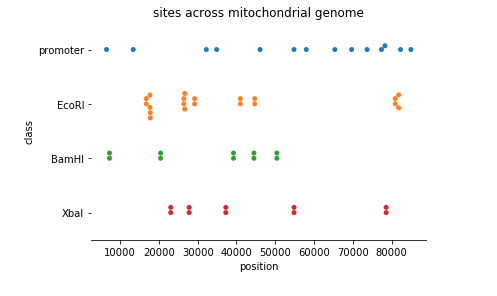

# Collection of scripts to plot sequence elements (sites) in relation to other sites and across chromosomes

# The scripts

* plot_sites_position_across_chromosome.py
> information about sites --> plot of sites across chromosome

See [the demo notebook TBD](????) for use. (That notebook can easily be uploaded and actively run once you launch a binder instance by pressing the `launch binder` button [here](https://github.com/fomightez/cl_sq_demo-binder).)  
The script is also used in a more typical workflow in a page [here](https://nbviewer.jupyter.org/github/fomightez/ptmbr-accompmatz/blob/master/notebooks/PatMatch%20with%20Python%20basics.ipynb) and [here](https://nbviewer.jupyter.org/github/fomightez/ptmbr-accompmatz/blob/master/notebooks/Iterating%20over%20genomes%20with%20PatMatch.ipynb). These two pages are part of a series of notebooks that can be run actively by pressing the `launch binder` button [here](https://github.com/fomightez/patmatch-binder).

Example output:

# Related items by me

- [Collection of scripts to find sequence elements in sequence data](https://github.com/fomightez/sequencework/tree/master/FindSequence)

# Related items by others

- ?
